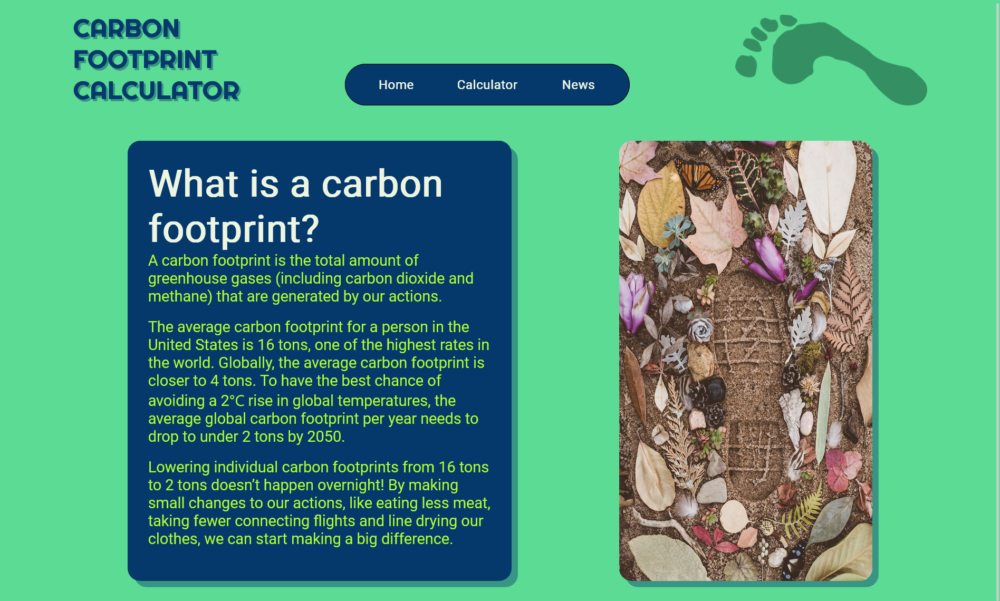
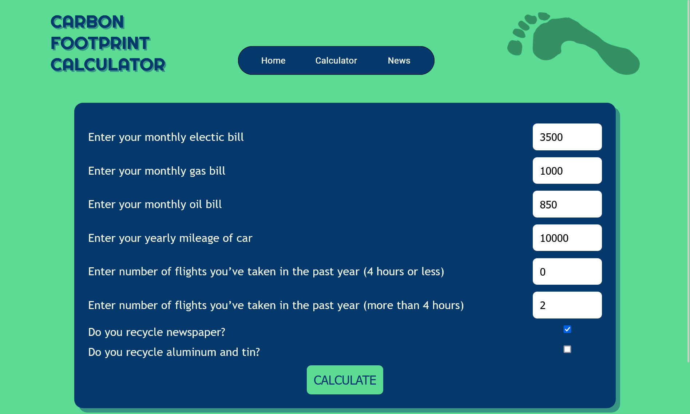
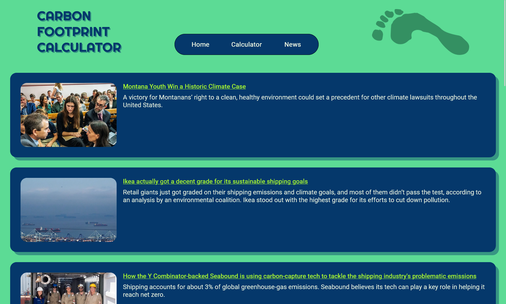

# Carbon Footprint Calculator

Welcome, this website is one-stop destination for all things related to understanding and reducing your carbon footprint. Our website is designed to empower you with information, tools, and up-to-date news about the environment and climate change.

## Pages

### Understanding Carbon Footprint

On this page, we provide a comprehensive overview of what a carbon footprint is. We explain how it's calculated, why it matters, and its impact on the planet. We break down the various components that contribute to your personal carbon footprint, from transportation and energy consumption to diet and lifestyle choices. You'll gain a clear understanding of the concept and its significance in the context of environmental sustainability.

### Calculate Your Carbon Footprint

Here, we offer an interactive carbon footprint calculator. By inputting data about your daily activities, such as your mode of transportation, energy consumption, and dietary habits, you can instantly estimate your personal carbon footprint. This tool is user-friendly and provides valuable insights into areas where you can make changes to reduce your environmental impact. We also offer tips and suggestions on how to lower your carbon footprint based on your individual results.

### Latest Environment and Climate News

Stay informed about the most recent developments in the world of environmental conservation and climate change on our third page. We curate and update a feed of the latest news articles, research findings, and policy updates from reputable sources. Whether it's breakthroughs in renewable energy, updates on international climate agreements, or stories of inspiring grassroots movements, you'll find it here. Our goal is to keep you informed and motivated to take positive actions for the planet.

## Screenshots

